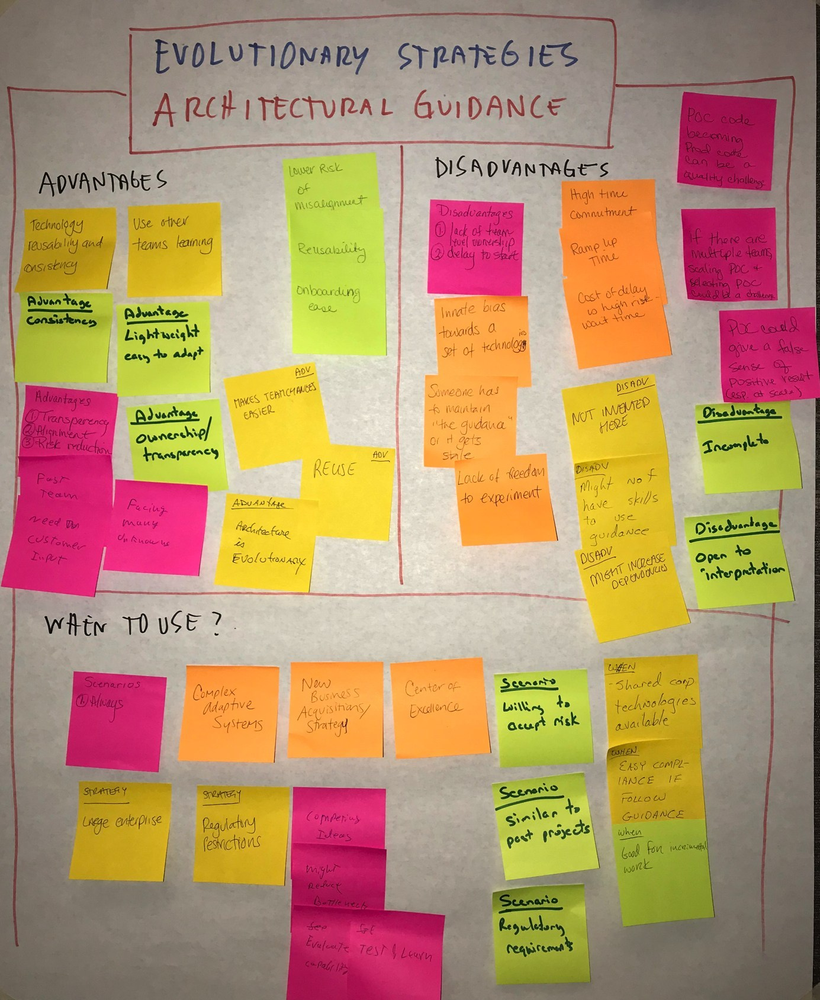

# Inception ：架构评估列表

http://disciplinedagiledelivery.com/agile-architecture-at-agile-2018/

## Architectural Guidance

> One of the approaches that our team uses to evolve our architecture is refer to our organization’s existing architectural guidance. 

Examples:

## Architecture Spikes

> One of the approaches that our team uses to evolve our architecture is to run architecture spikes (or simply called spikes). Whenever we run into an architectural issue, such as how a technology works within our environment or how a combination of technologies work together, we write a bit of code to explore the issue.  This is typically throwaway prototyping code because we want to quickly experiment to gather sufficient data to make a better-informed decision.  Spikes typically take a few hours to a few days. A spike can be thought of as a very small proof of concept (PoC).

## Walking Skeletons

> One of the approaches that our team uses to evolve our architecture is to develop a walking skeleton, also known as a working skeleton or steel frame, of our solution early in Construction.  We do this by focusing on a small collection of requirements early in the lifecycle that implement sufficient functionality to address our highest-risk items so as to show that our architectural strategy works in practice.  Once the walking skeleton is in place we spend the rest of Construction putting the functional flesh onto it.

## Just-in-time (JIT) Model Storming

> One of the approaches that our team uses to evolve our architecture is to explore requirement and design details at the last most responsible moment.

[Model Storming: An Agile Core Practice](http://agilemodeling.com/essays/modelStorming.htm)
