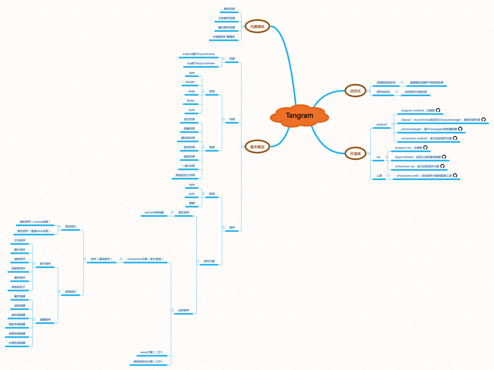

# 通用布局 DSL

```
DomainModel -> Name Term SceneRef
```

类型：

 - 输入：Form
 - 输出：Domain Model / Component Model


## Case Study

### 布局排版的流程图

引自：[动态界面：DSL&布局引擎](https://awhisper.github.io/2017/05/01/DSLandLayoutEngine/)

*   RenderTree parse
    *   浏览器内核的方案是
        *   解析HTML，生成Dom
        *   解析CSS，生成style rules
        *   attach Render Tree CSS与HTML挂载到一起
    *   Jasonette的方案是
        *   反序列化Json，直接生成Dom字典
*   RenderTree layout
    *   从RenderTree RootNode 遍历
    *   不同节点对应调用不同layout算法
    *   运算出每个可显示界面元素的位置信息
*   RenderTree render
    *   遍历Tree
    *   渲染

### Tangram



布局：

 - 流式(网格)布局
 - 一拖 N 布局
 - 浮动布局
 - 固定布局
 - 吸顶布局
 - 瀑布流布局
 - 轮播/横向滚动布局
 - 横向线性滚动布局

### Flexbox 布局

[由 FlexBox 算法强力驱动的 Weex 布局引擎](https://www.jianshu.com/p/d085032d4788)


