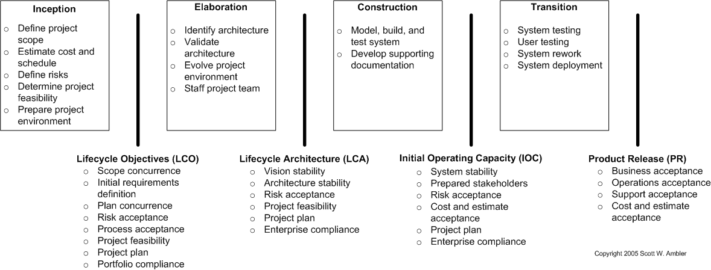

# Inception

## GOAL

 - Form Team
 - Align with Enterprise Direction
 - Explore Scope
 - Identify Architecture Strategy
 - Plan the Release
 - Develop Test Strategy
 - Develop Common Vision
 - Secure Funding

[The Lean Inception](https://martinfowler.com/articles/lean-inception/)

|   | morning | afternoon |
| --- | --- | --- |
| Monday | Introduce the inception, kick off, and [Write the Product Vision](https://martinfowler.com/articles/lean-inception/write-product-vision.html) | [The product Is – Is not – Does – Does not](https://martinfowler.com/articles/lean-inception/product-is-isnot.html) |
| Tuesday | [Describe the Personas](https://martinfowler.com/articles/lean-inception/describe-personas.html) | [Discover the Features](https://martinfowler.com/articles/lean-inception/discover-features.html) |
| Wednesday | [Technical and Business Review](https://martinfowler.com/articles/lean-inception/tech-and-business-review.html) | [Show the User Journeys](https://martinfowler.com/articles/lean-inception/show-user-journeys.html) |
| Thursday | [Display Features in Journeys](https://martinfowler.com/articles/lean-inception/display-features-in-journeys.html) | [Sequence the Features](https://martinfowler.com/articles/lean-inception/define-sequence.html) |
| Friday | [Build the MVP Canvas](https://martinfowler.com/articles/lean-inception/build-mvp-canvas.html) | Showcase the results of the inception to those interested in the project |

# Frontend Lifecycle

[Our large team of engineers use this front end development guide](https://www.freecodecamp.org/news/grabs-front-end-guide-for-large-teams-484d4033cc41/)

 - Single-page Apps (SPAs)
 - New-age JavaScript
 - User Interface
 - State Management
 - Coding with Style
 - Testing
 - Linting JavaScript
 - Linting CSS
 - Types
 - Build System
 - Package Management
 - Continuous Integration
 - Hosting
 - Deployment

# Milestones

# Inception Slide

[Inception in words](https://codelikethis.com/lessons/agile/inceptions)
