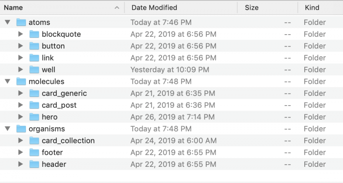

# 组件设计原则

## 分类

文章：[Component Design Patterns](https://medium.com/@nateeborn/component-design-patterns-cbe1bdc7261b)

Widget components

> Widget components are black-box components that accept context-specific configuration and that can ostensibly be added with just a line or two of code. Think a Facebook Plugin, a stock ticker widget, or a jQuery plugin or UI widget.

Compound components

> Compound components are a return to the goodness of markup languages. Think HTML lists or forms. Summarily a compound component is a collection of related, composable components, the compositions of which provide coordinated layout and/or interactivity and state.

Container components

> Container components are instead concerned with things like data, network requests, state management, and action handling.

[Presentational and Container Components](https://medium.com/@dan_abramov/smart-and-dumb-components-7ca2f9a7c7d0)

## 设计原则 

[Component Driven Development in Drupal](https://jigarius.com/blog/drupal-ui-patterns)

### 2. Defining patterns

**使用 YML 定义模式**：标记每种类型，以及对应的状态等。

```yml
blockquote:
  label: 'Blockquote'
  description: A block of text quoted from an external source.
  # variants: ...
  fields:
    content:
      type: text
      label: Content
      description: The body of the quote.
      preview: 'To be or to not to be... That is the question.'
    attribution:
      type: text
      label: Attribution
      description: Reference to the original author (optional).
      preview: 'William Shakespeare'
    cite:
      type: uri
      label: Citation
      description: URL where the original text can be found (optional).
      preview: 'https://example.com/'
  libraries:
    -
      blockquote:
        css:
          component:
            css/blockquote.css: {}
```

### 组织模式库代码



1. Atoms: Basic building-blocks or the smallest of patterns. Example: A title, an image, a button.
2. Molecules: Patterns that use one or more atoms. Example: A hero that comprises of a title, an image and a button.
3. Organisms: Patterns that use a combination of one or more molecules. Example: The page header comprising of a logo, a nav bar and a hero.
4. Templates: Groups of organisms and smaller patterns, stitched together to form pages. Example: A standard page that has a header and a footer.
5. Pages: Are “specific instances of templates” and they are “the most tangible”. Example: The home page or the contact page.

### 

[A New Approach to React Component Design](https://www.freecodecamp.org/news/a-new-approach-to-react-component-design-2bf76a87add1/)

分类：

 - Universal Components
 - Global Components
 - View Component

原则：

 - 可重用。Should be reusable
 - 高度可定制。Should be highly customizable
 - 不包含业务逻辑。Should not be aware of application-specific code including models, stores, services, etc.
 - 最小化第三方依赖。Should minimize dependencies on third party libraries
 - 很少直接在您的应用程序中使用。Should rarely be used directly in your application
 - 用作全局组件的构建块。Should be used as building blocks for Global components
 - 可能以 Base 结尾。May end with the “Base” suffix (eg. ButtonBase, ImageBase)
