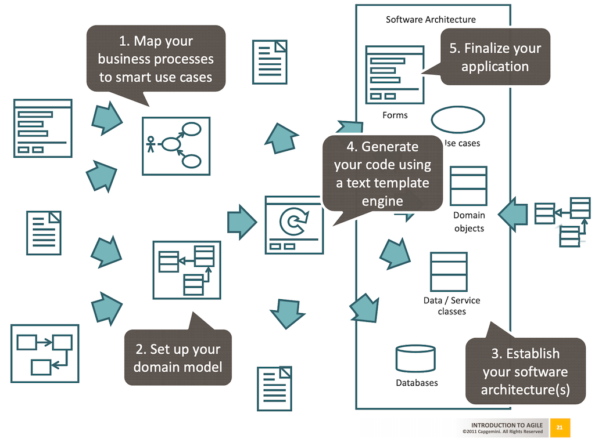

# Usecase

[Model driven development using smart use cases and domain driven design](https://www.slideshare.net/aahoogendoorn/20110308-capgemini-tech-ed-model-driven-development-7330864)

1. Map your business processes to smart use cases
2. Set up your domain model
3. Establish your software architecture(s)
4. Generate your code using a text template engine
5. Finalize your application

https://softwareengineering.stackexchange.com/questions/339568/which-should-be-done-first-use-cases-or-user-stories

> As you already found, a single use case has typically a broader scope than a single user story because it tries to completely describe a user interaction including errors and deviations from the normal path. A user story can be roughly compared to a single flow through a use case
  
单个 usecase 通常比单个用户故事更具有广泛的范围，因为它试图完全描述用户交互，包括错误和与正常路径的偏差。而用户故事可以粗略地与通过用例的单个流进行比较。

文档化

[Use Case Driven Documentation](http://tynerblain.com/blog/2006/10/10/use-case-driven-documentation/)

